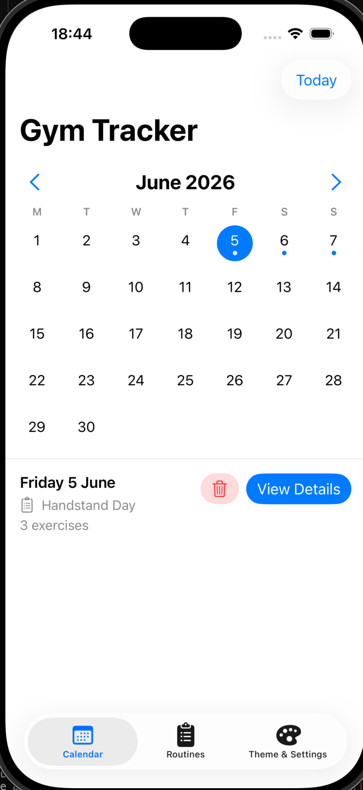
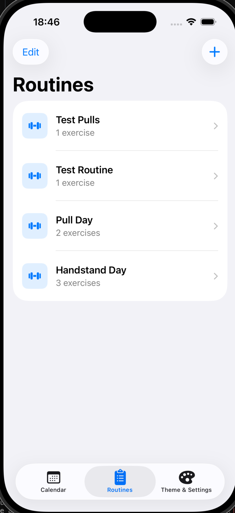
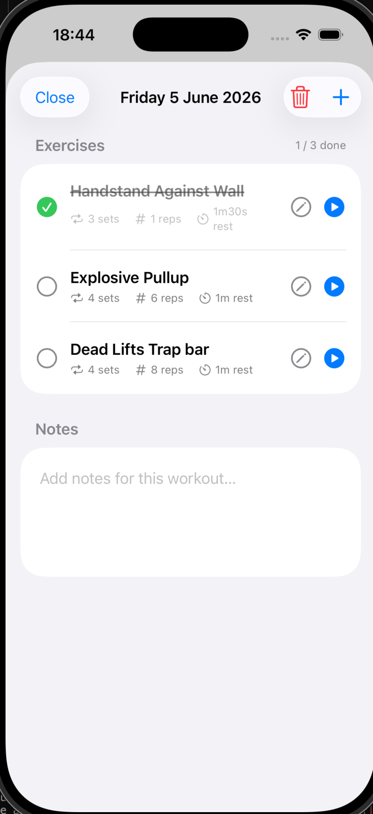
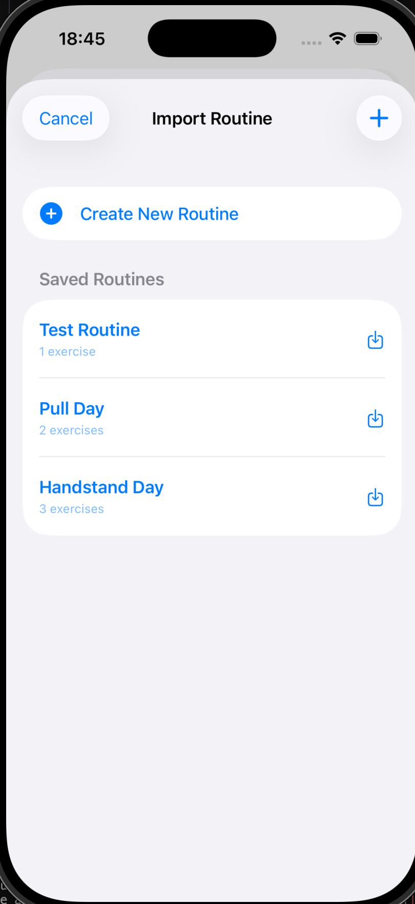
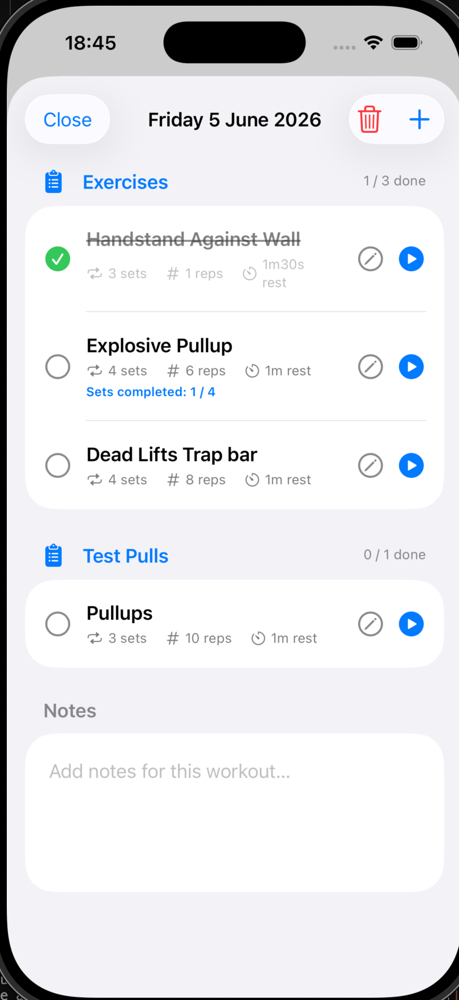
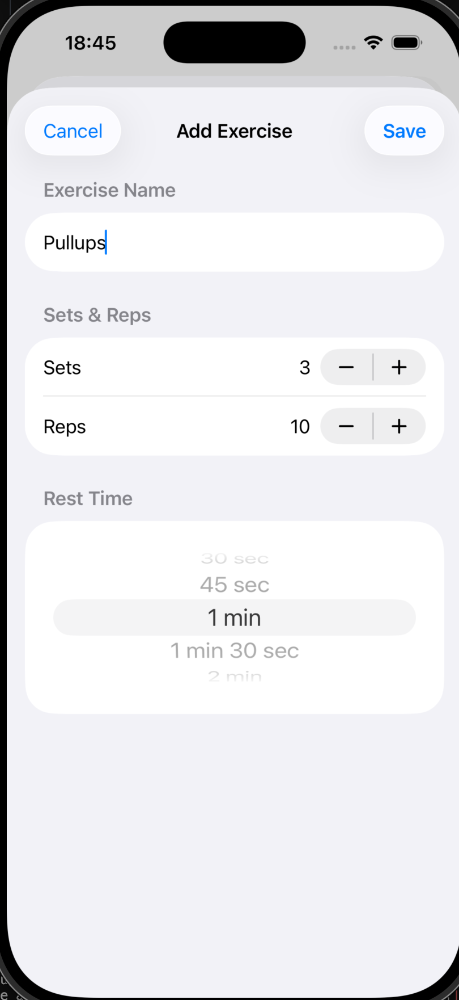
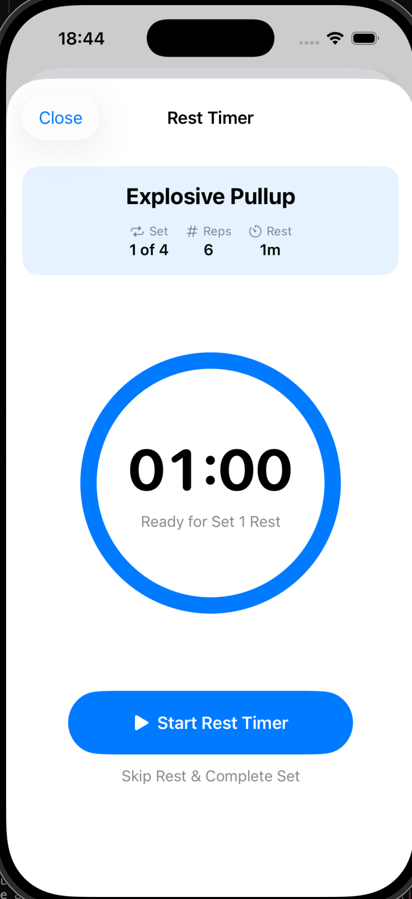
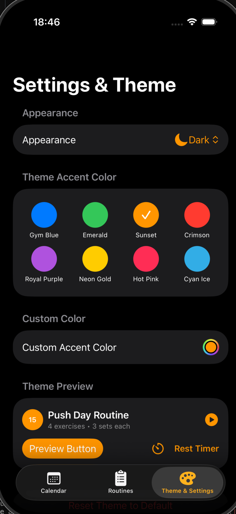

# Gym Tracker App 🏋️‍♂️

A vibe-coded, native iOS application built with **SwiftUI** and **SwiftData** designed to streamline workout tracking, routine management, and rest timing with a customizable interface.

---

## 🌟 Key Features

- 📅 **Workout Calendar View**: View logged workouts on a full monthly calendar grid with visual status indicators, summary cards, and quick day selection.
- 📋 **Routine Management**: Design and organize reusable workout routines. Add, edit, and reorder exercise templates with target set, rep, and rest parameters.
- 🏋️ **Workout Logging**: Import saved routines directly onto any calendar date, check off completed exercises/sets, and add personalized workout notes.
- ⏱️ **Interactive Rest Timer**: Animated circular progress timer for rest intervals between sets, equipped with haptic feedback, sound notifications, skip/pause options, and set counting.
- 🎨 **Custom Themes & Appearance**: Support for System, Light, Dark, and **OLED Black** appearance modes. Choose from 8 vibrant theme accent color presets (Gym Blue, Emerald, Sunset, Crimson, Royal Purple, Neon Gold, Hot Pink, Cyan Ice) or select a custom accent color.
- 💾 **SwiftData Persistence**: Fast, offline-first local storage using Apple's SwiftData framework.

---

## 📱 Screenshots Showcase

  
  
  

### 🗓️ Calendar & Routine Logging

| Calendar View | Routines List | Import Routine |
| :---: | :---: | :---: |
|  |  |  |
| *Track monthly activity with daily indicators and quick workout summaries.* | *Manage and edit your saved workout routines.* | *Import routines directly into any calendar date.* |

---

### 🏋️ Workout Details & Rest Timer

| Workout Progress | Exercise Setup | Interactive Rest Timer |
| :---: | :---: | :---: |
|  |  |  |
| *Track completed sets, edit exercise parameters, and keep notes.* | *Configure target sets, reps, and precise rest durations.* | *Circular rest countdown with haptic feedback and set completion.* |

---

### 🎨 Theme & Appearance Settings

   
  <em>Customize system/dark/OLED appearance and select custom accent colors.</em>

---

## 🛠️ Tech Stack & Architecture

- **Language**: Swift 5.9+
- **UI Framework**: SwiftUI
- **Data Persistence**: SwiftData
- **Architecture**: MVVM / Data-driven SwiftUI with `@Observable` state management
- **Models**:
  - `Routine` & `ExerciseTemplate`: Reusable routine definitions.
  - `WorkoutDay` & `WorkoutExercise`: Daily logged workout instances and exercise execution data.
  - `ThemeManager`: Centralized theme appearance and color customization state.

---

## 🚀 Getting Started

### Prerequisites

- **Xcode 15.0+**
- **iOS 17.0+** (Simulator or physical iOS device)
- macOS Sonoma or later

### Building and Running

1. Clone or download the repository.
2. Open `GymApp.xcodeproj` in Xcode.
3. Select your target device or simulator (e.g., iPhone 15 / iPhone 16).
4. Press `Cmd + R` to build and run the application.

---

## 📄 License

This project is licensed under the MIT License - see the [LICENSE](LICENSE) file for details.
